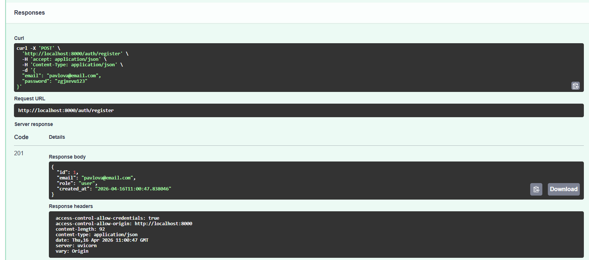
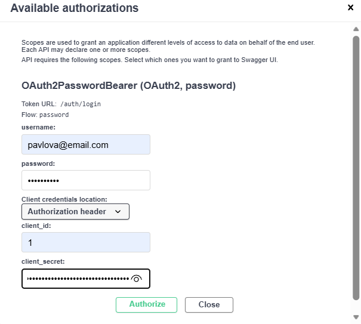
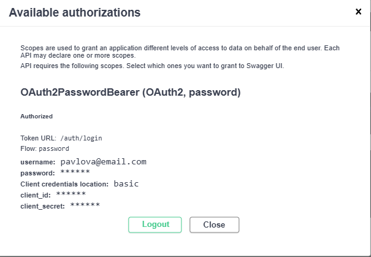
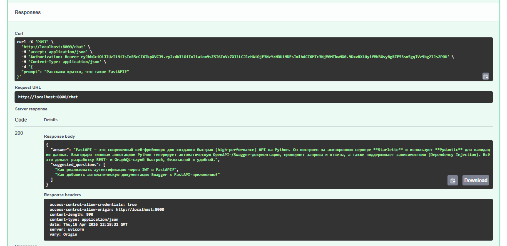
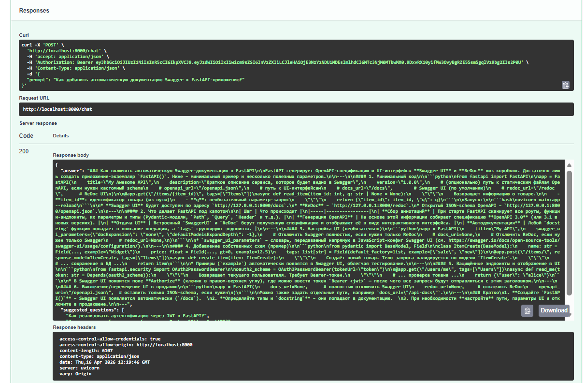
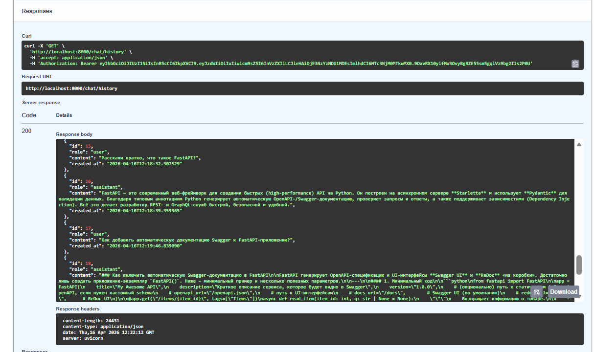
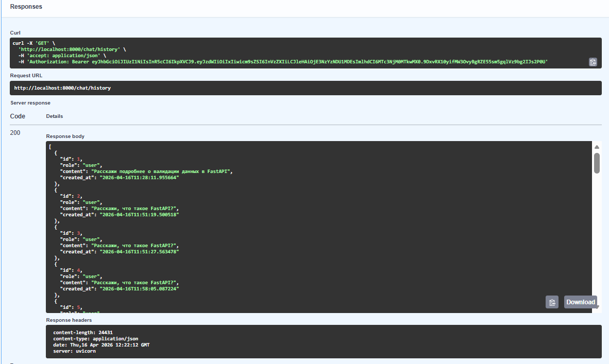
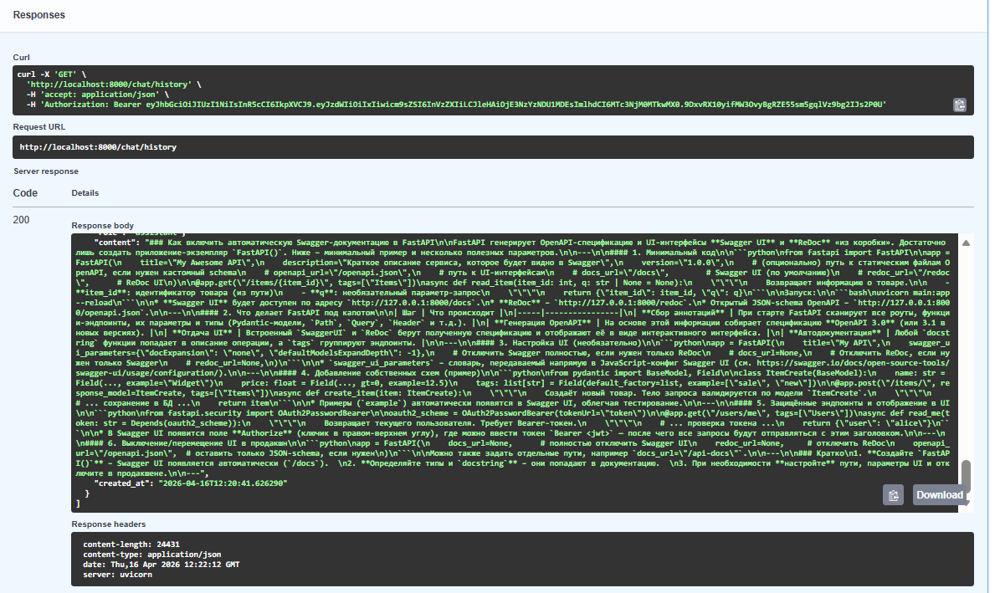
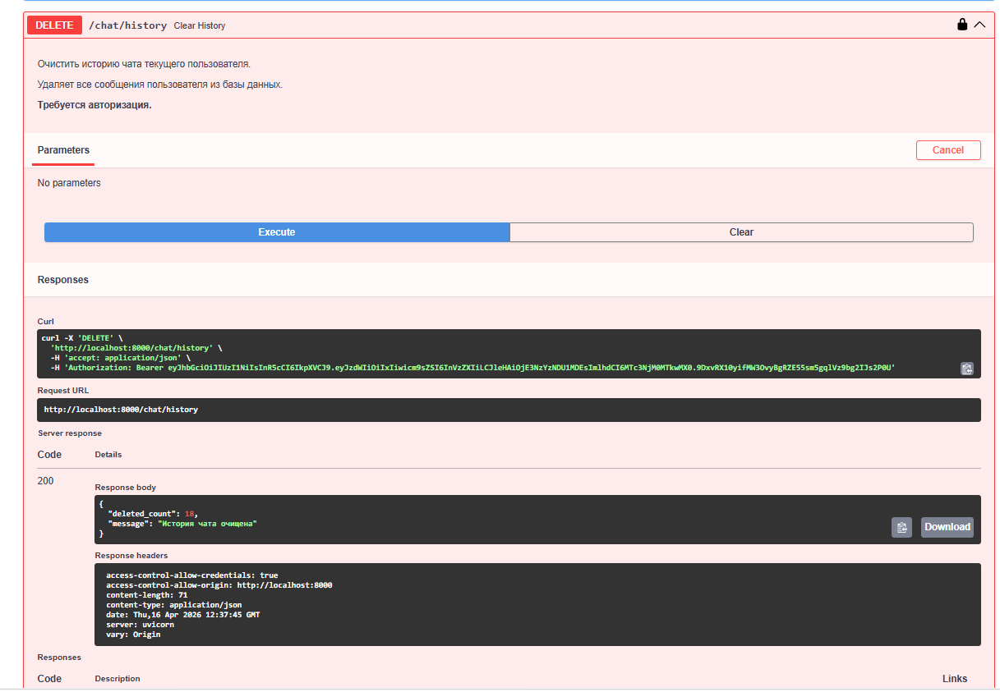
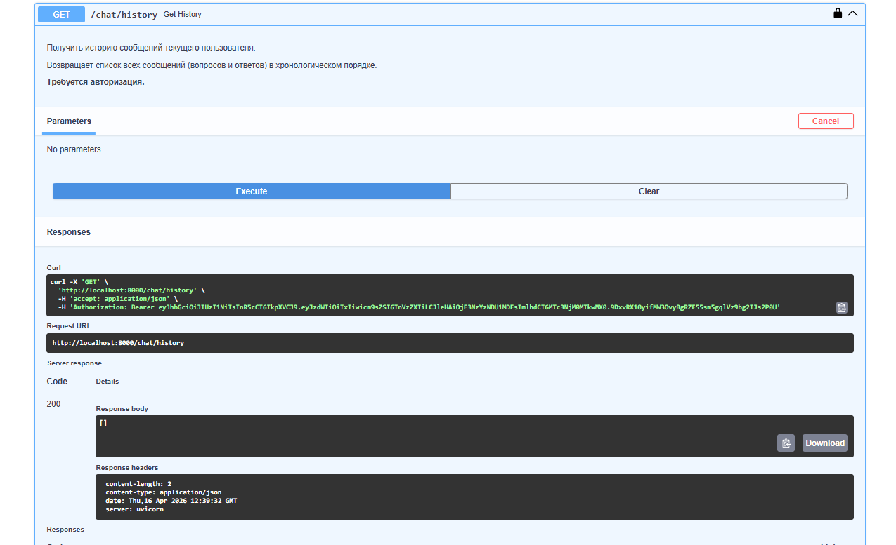

# LLM_Protected_API_Pavlova_M25-555

Асинхронное API для взаимодействия с большими языковыми моделями через OpenRouter.
Полноценная JWT-аутентификация, история диалогов и чистая архитектура.

## Установка

Для запуска проекта требуется Python 3.11+ и менеджер пакетов [uv](https://github.com/astral-sh/uv).

### Шаги установки

1. **Клонирование репозитория:**
```bash
git clone <https://github.com/natpavge-cloud/llm-api-pavlova-m25-555.git>
cd llm-p
```

2. **Инициализация проекта:**
```bash
uv init
```

3. **Создание виртуального окружения:**
```bash
uv venv
```

4. **Активация окружения:**
```bash
Linux/macOS
source .venv/bin/activate
```
```
Windows
.venv\Scripts\activate
```

5. **Установка зависимостей:**
```bash
uv sync
```

6. **Создание файла `.env`:**

За основу необходимо взять .env.example

> Получить API ключ можно на [OpenRouter](https://openrouter.ai/keys)

7. **Запуск проекта:**

Можно использовать Makefile для удобного запуска:
```bash
make run
```

Или напрямую через uv:
```bash
uv run uvicorn app.main:app --reload
```

Приложение доступно по адресу: **http://localhost:8000**  
Swagger документация: **http://localhost:8000/docs**


## Демонстрация работы (Скриншоты)
В соответствии с требованиями, для тестирования использован email формата pavlova@email.com.

1. **Регистрация пользователя (POST /auth/register)**
Создание нового аккаунта. В ответе возвращаются публичные данные пользователя.


2. **Логин и получение JWT (POST /auth/login)**
Обмен учетных данных на токен доступа.


3. **Авторизация в Swagger**



4. **Вызов чата (POST /chat)**
Успешное получение ответа от LLM через OpenRouter.



5. **Получение истории (GET /chat/history)**
Проверка сохранения сообщений в базе данных SQLite.




6. **Удаление истории (DELETE /chat/history)**
Очистка сообщений текущего пользователя.




## Структура проекта
```text
llm_p/
├── pyproject.toml                 # Зависимости проекта (uv)
├── README.md                      # Описание проекта и запуск
├── .env.example                   # Пример переменных окружения
│
├── app/
│   ├── init.py
│   ├── main.py                    # Точка входа FastAPI
│   │
│   ├── core/                      # Общие компоненты и инфраструктура
│   │   ├── init.py
│   │   ├── config.py              # Конфигурация приложения (env → Settings)
│   │   ├── security.py            # JWT, хеширование паролей
│   │   └── errors.py              # Доменные исключения
│   │
│   ├── db/                        # Слой работы с БД
│   │   ├── init.py
│   │   ├── base.py                # DeclarativeBase
│   │   ├── session.py             # Async engine и sessionmaker
│   │   └── models.py              # ORM-модели (User, ChatMessage)
│   │
│   ├── schemas/                   # Pydantic-схемы (вход/выход API)
│   │   ├── init.py
│   │   ├── auth.py                # Регистрация, логин, токены
│   │   ├── user.py                # Публичная модель пользователя
│   │   └── chat.py                # Запросы и ответы LLM
│   │
│   ├── repositories/              # Репозитории (ТОЛЬКО SQL/ORM)
│   │   ├── init.py
│   │   ├── users.py               # Доступ к таблице users
│   │   └── chat_messages.py       # Доступ к истории чатов
│   │
│   ├── services/                  # Внешние сервисы
│   │   ├── init.py
│   │   └── openrouter_client.py   # Клиент OpenRouter / LLM
│   │
│   ├── usecases/                  # Бизнес-логика приложения
│   │   ├── init.py
│   │   ├── auth.py                # Регистрация, логин, профиль
│   │   └── chat.py                # Логика общения с LLM
│   │
│   └── api/                       # HTTP-слой (тонкие эндпоинты)
│       ├── init.py
│       ├── deps.py                # Dependency Injection
│       ├── routes_auth.py         # /auth/*
│       └── routes_chat.py         # /chat/*
│
└── app.db                         # SQLite база (создаётся при запуске)
```

### Архитектура

Проект построен на принципах **Clean Architecture** с явным разделением слоёв:

API → UseCases → Repositories/Services → Database
- **API** — только преобразование HTTP ↔ Pydantic
- **UseCases** — вся бизнес-логика
- **Repositories** — только SQL/ORM запросы
- **Services** — внешние API (OpenRouter)


## Технологии

| Компонент | Технология |
|-----------|------------|
| Фреймворк | FastAPI 0.112+ |
| База данных | SQLite + aiosqlite |
| ORM | SQLAlchemy 2.0 |
| Валидация | Pydantic 2.7+ |
| Аутентификация | python-jose + bcrypt |
| LLM API | OpenRouter |
| HTTP Client | httpx |
| Менеджер пакетов | uv |


## Автор
**Павлова Наталья Геннадьевна**

- Email: natpav.ge@gmail.com
- Группа: М25-555
